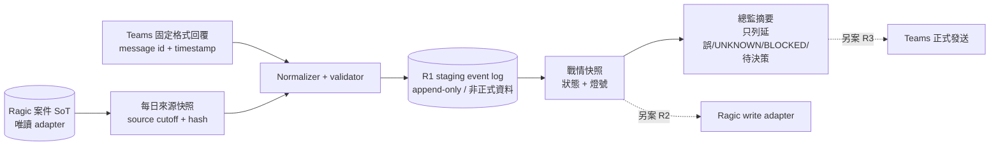

# Issue #5｜第一階段唯讀盤點與方案設計

## 0. 結論先行

本階段完成「盤點 → 設計 → 本機 dry-run」，沒有部署、沒有發送 Teams、沒有修改 Ragic、沒有啟用或修改排程，也沒有寫入 NAS 正式來源。

目前可確認：

1. 2026-08-17～2026-08-25，指定 Teams 公告頻道可回讀一個歷史單案的每日任務公告與晚間成果回報；2026-08-26 可回讀出國期間案件代理交接公告。這證明歷史訊息確實存在，不等於今天仍有相同排程。
2. NAS 上現有 n8n C1 潛客流程仍為 active，包含 Teams 與 Planner 節點，且 2026-09-08 仍有每五分鐘成功 execution。它處理的是「潛客 → Ragic／Teams／Planner」，不是公司案件進度戰情，不應直接改造成 Issue #5。
3. 找不到目前仍 active 的「公司全案每日戰情」排程。現有 Codex 09:00／17:00 CAIOS heartbeat 只檢查 CAIOS 文件與決策，不會收集同仁案件進度，也不會發 Teams。
4. 正式規則與歷史紀錄互相衝突：2026-06 的歷史 STATUS 曾稱 Teams／Planner C1 延伸已上線；現行 `AI_RULEBOOK.md` 則明定 Teams 自動發訊角色與範圍尚未核准。故只能把「C1 潛客分支存在並運行」列為 VERIFIED，把「可直接用於案件戰情外發」列為 NOT_READY。
5. Issue #5 所列 2026-08-26 案件只能作為歷史 seed。未取得 Ragic 當前案件資料與逐案證據前，八案的最新進度全部維持 UNKNOWN，不由檔名、聊天或舊公告推算完成率。

建議採用「獨立、可關閉、先 shadow mode」的小型工作流：Ragic 維持案件結構化 SoT，Teams 負責人回覆作為輸入，n8n 只做排程／整理／稽核；第一個 canary 只讀 Ragic、只產本機摘要，不外發、不寫回。正式 Teams 發送、排程啟用與 Ragic 寫回分成三個獨立核准 gate。

## 1. 核准邊界與實際動作

| 項目 | 本階段狀態 |
|---|---|
| GitHub Issue／repo／PR／CI 查詢 | R0 已執行 |
| NAS INDEX／RULEBOOK／STATUS／CAIOS 四件套／AI_BRIDGE 查詢 | R0 已執行 |
| Teams 歷史訊息與 Planner 唯讀查詢 | R0 已執行 |
| n8n workflow metadata／execution metadata 唯讀查詢 | R0 已執行；未讀 credentials 或 execution payload |
| 本分支文件、schema、匿名範例與 dry-run validator | R1 已建立 |
| Teams 訊息發送／回覆／提醒 | 禁止，未執行 |
| 排程建立、啟用或修改 | 禁止，未執行 |
| Ragic 查詢 | BLOCKED_EXTERNAL；本工作階段無核准的 Ragic 唯讀連線 |
| Ragic／NAS 正式資料寫入 | 禁止，未執行 |
| n8n workflow 修改／啟用／部署 | 禁止，未執行 |

本文件與 Draft PR 是候審工件，不更新 CAIOS 正式 STATUS，也不代表總監接受。

## 2. 現況盤點

### 2.1 證據摘要

| ID | 分類 | 觀察 | 判定 |
|---|---|---|---|
| E01 | GitHub | `master` 在盤點時指向 `3afbb95`；repo 只有官網內容／建頁與 CI 工具，master 無 Teams、Planner、Ragic 戰情程式 | VERIFIED |
| E02 | CAIOS 治理 | NAS 正式 `INDEX.md`、`AI_RULEBOOK.md`、`STATUS_現況與問題.md` 已回讀；R0/R1 可自主、外部訊息為 R3、正式寫回需另案核准 | VERIFIED |
| E03 | 四件套 | NAS 與 Windows mirror 的 README／STATUS／HANDOFF／PATH_MAP 四個 SHA-256 逐一一致；正式 `project_id` 是 `caios-enterprise-architecture` | VERIFIED |
| E04 | Mission／TASK | 以 Issue #5、戰情、2026-08-26 等關鍵字查找，未發現本案專用的 active Mission／TASK；最新可驗證 AI_BRIDGE 屬其他專案，不能沿用 | UNKNOWN／NOT_READY |
| E05 | Teams 歷史 | 2026-08-17～08-24 可回讀七則每日任務公告；08-18 明載原排程異常而補發；08-17～08-25另有晚間成果回報；08-26 有出國期間交接公告 | VERIFIED（歷史訊息） |
| E06 | n8n runtime | 正式 n8n DB 有一個 active 的 27-node C1 workflow；包含 Teams／Planner 分支；2026-09-08 持續每五分鐘成功觸發 | VERIFIED（潛客流程） |
| E07 | Teams／Planner C1 | 正式 2026-06-08 規格 frontmatter 是「待執行」；後續 STATUS 又稱 06-09 已上線；live n8n 證明分支存在，但不能證明每次對外動作、權限與回讀均仍有效 | CONFLICT |
| E08 | `daily-sync` | Ubuntu 工作技能自述為手動觸發、未排程，Teams payload schema 未實測；它是晨間洽詢／客服摘要，不是案件戰情 | NOT_READY |
| E09 | 本機排程 | 現有 active 排程為郵件／行事曆摘要、官網檢查、CAIOS 文件 heartbeat 等；未找到公司案件戰情排程；一個 Teams 確認追蹤已 PAUSED | VERIFIED（查無相符 active 項） |
| E10 | Planner | 唯讀列出 47 個 Planner plans；兩個案件候選 plan 與一個通用專案管理 plan 實際有 tasks，但混有舊任務、已完成項目與通用模板，尚不能視為 Issue #5 的現行戰情 | VERIFIED（存在 tasks）／UNKNOWN／CONFLICT（新鮮度與用途） |
| E11 | Ragic | 現行規則指定 Ragic 為案件結構化 SoT，但本工作階段沒有可用的 Ragic 唯讀工具，未取得八案當前紀錄 | BLOCKED_EXTERNAL |
| E12 | 09:00 警報 | 可確認 09:00 類排程存在，但內容是郵件／行事曆或 CAIOS 文件監控，不是 Issue #5 的全案戰情收集 | VERIFIED（不同用途） |

### 2.2 證據定位（不含秘密）

- GitHub：Issue `alexwei0413/coembank#5`、`master@3afbb95`、既有 PR／Actions metadata。
- NAS 正式治理：`knowledge-base/INDEX.md`、`AI_RULEBOOK.md`、`STATUS_現況與問題.md`。
- NAS CAIOS 四件套：`knowledge-base/projects/caios-enterprise-architecture/{README,STATUS,HANDOFF,PATH_MAP}.md`。
- NAS 歷史規格：`knowledge-base/decisions/20260608-Teams自動化執行規格.md` 與接線前 workflow backup；只抽取 workflow 名稱、active、node name/type，不讀 credentials／parameters。
- NAS runtime：`docker/n8n/data/database.sqlite`；只讀 workflow／execution metadata，不讀 execution payload、credential tables 或 token tables。
- Teams：以唯讀 connector 回讀指定公告頻道 2026-08-17～08-26 的相關 thread metadata／摘要，不把頻道、message 或成員 ID 複製到 Git。
- Planner：以唯讀 connector 盤點 47 個 plans，並回讀兩個案件候選 plan 與一個通用專案管理 plan 的 tasks；不把 plan／task ID 複製到 Git，也不建立或更新 task。這些 tasks 的現行有效性與 Issue #5 對應仍待 Ragic case key 交叉查證。
- Windows：`C:/Users/user/.codex/automations/*/automation.toml` 與 Windows Scheduled Tasks 唯讀清單。
- Ubuntu 工作證據：`/home/pro/.claude/skills/daily-sync/SKILL.md`；它是工作技能文件，不是正式 SoT。

四件套在盤點時的 NAS／Windows SHA-256 比對結果：

| 檔案 | SHA-256 | 結果 |
|---|---|---|
| README.md | `b4cdab0a638810c0fda0c2469f7e4a01205088c2babb8c21f666ae0392a508f6` | MATCH |
| STATUS.md | `97175a89dd66e7ae70de800534c81490023c77862c22a71d1f2b8067bbcc12e6` | MATCH |
| HANDOFF.md | `5ecc979e46a9b3bfa5d11de806e557a2760d5790a0b43108915a9df2bbb89404` | MATCH |
| PATH_MAP.md | `0b837c8aced32db26c4051e1601204224a747a6eb4423b3e2f6e2461e834bafb` | MATCH |

### 2.3 已部署與只有草稿的分界

| 元件 | 實際狀態 | 不可延伸解讀 |
|---|---|---|
| Teams 歷史單案每日公告／晚間回報 | 歷史訊息在 Teams 平台可回讀 | 不代表當前 scheduler 存在或正常 |
| n8n C1 潛客 workflow | live DB active；27 nodes；近期 execution success | 不代表它是案件戰情，也不代表 Teams／Planner 每次都有外部效果 |
| Teams／Planner C1 設計規格 | 文件存在，且部分設計已反映在 live workflow | 文件 `status: 待執行` 與後續紀錄衝突，不能單憑文件稱完整驗收 |
| Ubuntu `daily-sync` | 手動技能文件存在 | 明載未排程、payload 未實測；不可稱已上線 |
| 公司全案戰情資料表 | 未找到單一現行模型或 SoT mapping | 不可用散落 Planner plans 當成已建立 |
| 19:00 全案摘要排程 | 未找到現行 active 排程 | 歷史 21:00 單案回報不能替代 |
| CAIOS 09:00／17:00 heartbeat | active，但只檢查 CAIOS 專案文件／決策 | 不會收同仁回報，不應冒稱公司戰情 |

### 2.4 2026-08-26 seed 的安全用法

下列八個項目僅證明「Issue #5 要求查證的歷史 seed」；不得直接視為 2026-09-08 現況：

| Seed | 歷史來源 | 最新狀態 |
|---|---|---|
| SEED-01 | Issue #5；Teams 08-17～08-25 日報 | UNKNOWN |
| SEED-02 | Issue #5；Teams 08-26 交接公告 | UNKNOWN |
| SEED-03 | Issue #5；Teams 08-26 交接公告僅能部分對照 | UNKNOWN |
| SEED-04 | Issue #5；Teams 08-26 交接公告 | UNKNOWN |
| SEED-05 | Issue #5；Teams 08-26 交接公告 | UNKNOWN |
| SEED-06 | Issue #5；Teams 08-26 交接公告 | UNKNOWN |
| SEED-07 | Issue #5；Teams 08-26 交接公告 | UNKNOWN |
| SEED-08 | Issue #5 | UNKNOWN |

Phase 2 首次唯讀 Ragic 盤點時，必須用正式案件 key 對照，不以人名或模糊案名自動合併；同名或多 plan 一律標 `CONFLICT`。

## 3. 最小可行架構



設計原則：

1. 不改現有 C1 潛客 workflow；另建隔離 workflow，避免 lead 流程與工程案件互相拖累。
2. Ragic 保持案件結構化 SoT；Teams 回覆是事件證據，不另造永久 Markdown 台帳。
3. shadow mode 只讀來源，輸出到隔離 staging。任何 Ragic write adapter、Teams sender、scheduler 預設 disabled。
4. 每次 snapshot 固定 `source_cutoff_at`、輸入 message ref、資料 hash；重跑用 `snapshot_id` 去重。
5. 不從檔案時間或自然語言猜完成率；沒有證據即 UNKNOWN，有互斥來源即 CONFLICT。
6. worker 與 validator 分離：本 PR 的 worker 是 Harness，validator 是 ChatGPT；核准後 canary 仍需另指定獨立驗證者。

## 4. 戰情資料模型

機器契約見 [`project-war-room.schema.json`](project-war-room.schema.json)，匿名 dry-run 輸入見 [`baseline.example.json`](baseline.example.json)。核心欄位：

| 欄位 | 用途 |
|---|---|
| `case_key`／`case_name` | 正式案件 key 與顯示名稱；key 必須來自 SoT |
| `owners`／`collaborators` | 負責人與協作人；正式部署時存受控 ID，公開輸出只顯示角色或名稱 |
| `phase` | 當前階段，不由 AI 自由創造選項 |
| `last_verified_progress` | 上次已驗證進度、驗證時間與證據 refs |
| `today_completed` | 同仁今日實際完成，空白不等於 0% |
| `next_step`／`planned_completion_date` | 下一步與承諾日期 |
| `blockers`／`director_decisions` | 卡點與待總監決策；分開存，避免摘要混淆 |
| `evidence_refs` | Teams message、Ragic record version、檔案 hash 等引用；不存秘密 |
| `evidence_status` | VERIFIED／INFERRED／UNKNOWN／CONFLICT／NOT_READY／BLOCKED_EXTERNAL |
| `traffic_light` | 正常／注意／延誤／未知；由固定規則導出並檢查 |
| `last_verified_at`／`verified_by` | 驗證新鮮度與角色 |

### 4.1 燈號規則（draft）

優先順序由上而下：

1. `UNKNOWN`、`CONFLICT`、`NOT_READY` → `未知`。
2. 到期日已過，或 `BLOCKED_EXTERNAL` 且已逾期 → `延誤`。
3. 有 blocker／待決策、`BLOCKED_EXTERNAL` 未逾期，或兩天內到期 → `注意`。
4. 其餘且有 VERIFIED／INFERRED 證據 → `正常`。

INFERRED 可以用來排程關注，但不能被摘要改寫成 VERIFIED。

## 5. Teams 每日回報模板

正式啟用前，先固定一案一段，禁止只回「處理中」：

```text
【案件】<正式案件代碼／名稱>
1. 目前做到哪：<階段＋可驗證進度>
2. 今天實際完成：<具體成果；若無請寫「今日無可驗證完成」>
3. 下一步＋預計完成日：<下一動作>｜YYYY-MM-DD
4. 卡點／需總監決定：<無／具體問題＋最晚決策日>
證據：<Ragic／Teams／檔案或審查連結；不得貼密碼、token、客戶個資>
```

回覆規則：

- 多案要分段，不把多案塞在一個無法解析的段落。
- 系統只接受 template 欄位；缺欄位標 NOT_READY，不自動補「已完成」。
- 附件或連結存在不等於完成；仍要有 reviewer／驗收證據。
- 發送時間、頻道、對象、安靜時段與逾時提醒次數均待總監核准。

## 6. 自動化 implementation plan

### Phase 2A｜R0 唯讀基線

1. 建立本案正式 Mission／TASK，固定 `project_id=caios-enterprise-architecture`、worker、validator、來源與停止條件。
2. 取得 Ragic 唯讀連線，列出「進行中案件」的正式 form／view／field IDs；逐欄 readback，不猜欄位。
3. 以正式 case key 對照 Issue seed、Planner plans 與 Teams 08-26 交接公告；輸出 VERIFIED／CONFLICT／UNKNOWN mapping。
4. 鎖定資料截止時間，產出匿名或最小必要的 baseline snapshot；不寫回。

### Phase 2B｜R1 shadow canary

1. 新建隔離 workflow 定義，不修改 live C1。
2. sender、Ragic writer、schedule 全部 hard-disabled；僅以固定 fixture 或唯讀 snapshot 產生戰情與總監摘要。
3. 測試正常、缺回覆、重複回覆、衝突來源、逾期、連線中斷、重跑去重與敏感字串拒絕。
4. 由獨立 validator 重新執行 fixture、核對 hash 與零外部呼叫證據。

### Phase 3｜需分項核准的有限 canary

1. **Teams R3 gate**：只允許指定測試對象／頻道、固定模板、單次發送；發送後以 Teams message ID 回讀。
2. **排程 R3 gate**：核准時區、時間、工作日、安靜時段、重試上限、kill switch；先跑 3～5 個工作日。
3. **Ragic R2 gate**：只允許核准 form／record／field 白名單；前值、後值、版本與回復方法逐筆留證。
4. Teams 發送成功不代表 Ragic 寫入成功；兩條結果各自驗證，不做跨系統假成功。

### Phase 4｜正式化（本 PR 不包含）

1. 觀察 canary 後，由總監決定是否轉 production。
2. 發布正式 Mission、SOP、欄位 mapping、runbook、rollback 與 owner。
3. 正式流程只輸出延誤、未知、外部阻擋、待決策；其他案件留在戰情表，不轟炸總監。

## 7. 本機 dry-run

執行：

```bash
npm ci --ignore-scripts --no-audit
npm run validate:war-room
npm test
```

程式只讀 JSON Schema 與一個 JSON snapshot，並把摘要寫到 stdout；沒有 HTTP client、沒有 webhook、沒有 Ragic、沒有排程、沒有檔案寫入。Draft 2020-12 schema 與 format 驗證由鎖定版本的 Ajv／ajv-formats 執行，另以固定規則檢查 key 唯一性、燈號與資料截止時間。

預期匿名範例：四案中只輸出「延誤／BLOCKED」與「UNKNOWN／待決策」兩案；僅因兩天內到期而顯示「注意」的 INFERRED 案不進總監摘要。

## 8. 需要總監另行核准

1. 正式 Mission／TASK 與本案 worker／validator。
2. Ragic 進行中案件的 form／view／field 白名單與唯讀憑證通道。
3. 正式案件清單、case key mapping、負責人／協作人。
4. Teams 使用哪個 team／channel 或 1:1 chat，以及發送者身分。
5. 每日時間（建議先評估 18:00 收集、18:45 截止、19:00 摘要）、工作日與假日規則。
6. 單次 Teams canary 外發、之後是否允許白名單排程。
7. 是否建立 Ragic 戰情欄位；欄位白名單、備份、回復與逐筆 readback。
8. 觀察期、成功率門檻、最大重試、kill switch 與人工接手者。

上述項目可分開核准；核准其中一項不推定其他項也獲准。

## 9. ChatGPT 驗證契約

請 ChatGPT 只讀檢查本 Draft PR，回覆：

- `decision`: pass／conditional_pass／reject
- `blocking_findings`
- `non_blocking_findings`
- `required_changes`
- `evidence_checked`
- `recommended_next_step`

至少驗證：

1. 是否把歷史訊息、live n8n C1 與 Issue #5 戰情機制清楚分開。
2. 是否完整保留 UNKNOWN／CONFLICT／NOT_READY／BLOCKED_EXTERNAL。
3. schema、fixture、validator 是否無網路與外部寫入能力。
4. Teams、排程、Ragic 寫入是否各自有獨立 gate。
5. 是否沒有秘密、內部 ID、webhook URL、token、客戶個資或 execution payload 進 Git。
6. worker 與 validator 是否分離；不得由 Harness 自行把本 PR 判定為通過。

## 10. 尚未證明

- Ragic 目前「進行中」案件與八案的最新狀態。
- 歷史單案日報究竟由哪個 scheduler／workflow 產生、現在是否仍存在。
- Power Automate／Graph／Teams webhook 的現行權限、owner、到期與 kill switch。
- 相關 Planner plans 有 tasks，但其新鮮度、正式用途及與 Issue #5 的對應尚未證明。
- 19:00 是最終核准時間；目前只是 Issue 線索與建議候選。

因此本案狀態只能是 `READY_FOR_CHATGPT_VALIDATION`，不是 deployed、published、approved 或 done。
